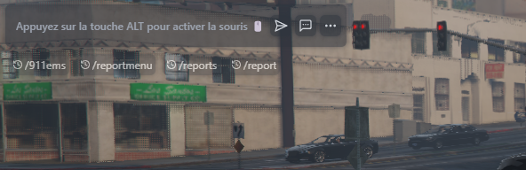
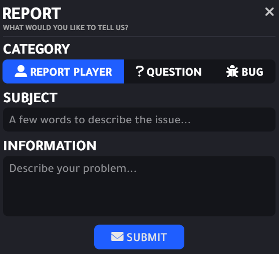
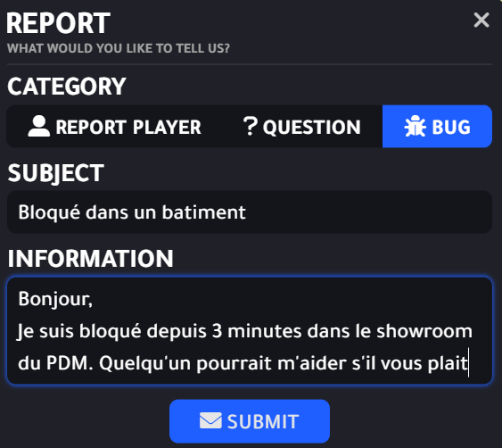
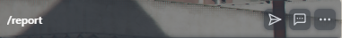
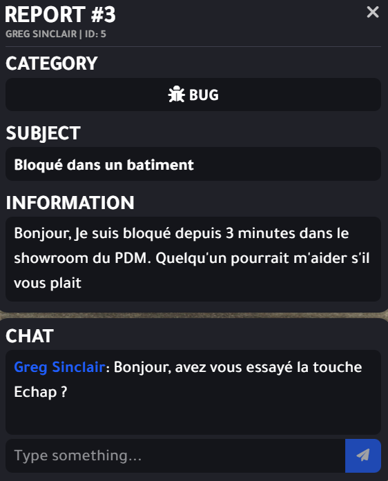

# 🎆 Pour commencer


💡 **Conseil du Staff :** Bienvenue sur le WIKI LS Five, ici vous trouverez toutes les astuces afin de profiter au mieux de votre serveur favori.


## Welcome to Los Santos
La ville où tout est possible…

## En cas de problème en jeu :

Contactez un STAFF en allant dans le **CHAT** *In Game* en appuyant sur la touche **T :**

Saisissez la commande suivante : **/report puis ENTER**

Cette fenêtre va s’ouvrir :

Sélectionnez la catégorie :

- **REPORT PLAYER :** Si vous êtes victime d’un comportement non RP
- **QUESTION :** Pour toute question technique en jeu
- **BUG :** Pour tout souci technique rencontré en jeu

Dans **SUBJECT,** inscrivez le motif de votre **REPORT**

exemple : ”Bloqué dans un endroit”

Dans **INFORMATION**, décrivez précisément ce qui se passe en utilisant des phrases compréhensibles, pas d’abréviation et en usant de politesse.
exemple : ”Bonjour, je suis bloqué dans le showroom du PDM, pourriez vous m’aider s’il vous plait ?”

Puis cliquez sur **SUBMIT** pour envoyer votre report. Une notification apparaît en haut et à droite de votre écran 

<aside>
⚠️ Le STAFF peut parfois mettre du temps à vous répondre, cela va dépendre du nombre de Modérateurs connectés et de leur capacité à pouvoir répondre à votre problème. 
Vous ne pourrez envoyer qu’un seul REPORT à la fois.
Ne soyez pas désagréable, cela pourrait vous desservir.

</aside>

Lorsque que quelqu’un vous répond, une notification apparaît en haut et à droite de votre écran.

Faite de nouveau la commande **/REPORT** pour accéder à la réponse.

Vous arriverez sur la même fenêtre que tout à l’heure mais le chat entre vous et le Modérateur LS Five.

A tout moment le Modérateur pourra se joindre à vous ou vous téléporter à lui pour résoudre votre souci. Le Modérateur fera toujours en sorte d’éviter de couper une scène RP.
Si la situation l’exige le Modérateur stoppera la scène si il juge que la situation devient critique.